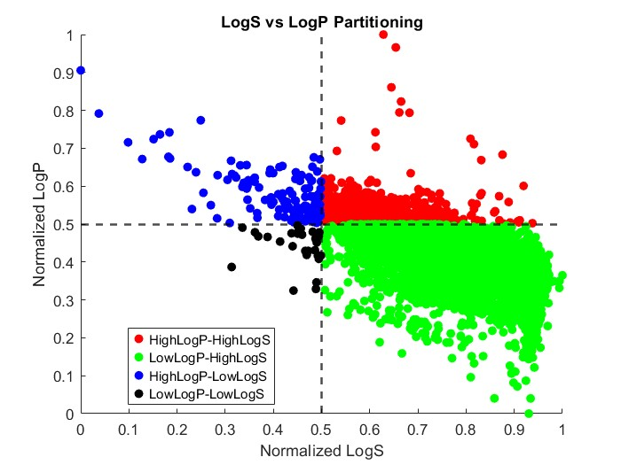

#  Import, Visualize, and, Partition Molecular Datasets

This example illustrates the integration of [MATLAB&reg;](https://matlab.mathworks.com/)-[RDKit](https://www.rdkit.org/) for molecular data processing and analysis, specifically focusing on [Lipophilicity](https://www.sciencedirect.com/topics/biochemistry-genetics-and-molecular-biology/lipophilicity) and [Aqueous Solubility](https://www.sciencedirect.com/topics/biochemistry-genetics-and-molecular-biology/solubility) data. These parameters are crucial in molecular design and drug discovery, as they significantly impact a compound's pharmacokinetics and bioavailability. By understanding and optimizing these properties, one can enhance a drug's therapeutic efficacy through improved absorption, distribution, and interaction with biological targets.

In this example, we demonstrate how to import a database containing such data in .csv format. The data, as reported in Ref. [1](https://www.mdpi.com/1420-3049/26/20/6185), can be accessed via the [link](https://zenodo.org/records/5137613#.YQortyWxVhG) provided in the referenced paper. 

The example also showcases how to visualize any selected molecule from the [SMILES](https://en.wikipedia.org/wiki/Simplified_molecular-input_line-entry_system) strings in loaded database, along with its corresponding LogP and LogS values. Subsequently, the database is partitioned based on the normalized LogP and LogS values as shown in the above figure.

## Video
Check out the accompanying video to see how this code works in action! 
> [Video: Import, Visualize, and Partition Molecular Data Sets](https://www.mathworks.com/videos/import-visualize-and-partition-molecular-data-sets-1745472434399.html)

## Setup 
To Run this example use this MATLAB Live Script: 
> Import_Visualize_and_Partition_Molecular_Datasets.mlx  

### MathWorks Products (https://www.mathworks.com)

> [MATLAB](https://www.mathworks.com/products/matlab.html)

### 3rd Party Products:

> [Python&reg;](https://www.python.org/)

> [RDKit Open-Source Cheminformatics Software](https://www.rdkit.org/)

## Installation
Set up your Python environment by following the instructions provided in the guide found at [Python](https://www.python.org/) webpage. Make sure to give the python address and to check versions of Python compatible with MATLAB products by release. This allows to build proper [MATLAB Interface to Python](https://www.mathworks.com/support/requirements/python-compatibility.html). 

This example uses some of the functions from [RDKit](https://www.rdkit.org/). It can be installed easily by following its installation instructions on Linux, Windows, and macOS. You can install RDKit using _pip install rdkit_.

## Getting Started 
Follow the steps provided in this MATLAB Live Script:
> Import_Visualize_and_Partition_Molecular_Datasets.mlx  

## Exercises
Try the exercises provided at the end of this example:

> **Investigate Correlation:** Is there a correlation between the similarities in molecular structures and their corresponding LogP and LogS values?

> **Analyze Partitioned Data:** Load each of the newly saved partitioned datasets and visualize 10 sample molecules from each one. Do you observe any similarities among them?

### References
> [1] Oliver Wieder, et. al., "Improved Lipophilicity and Aqueous Solubility Prediction with Composite Graph Neural Networks", Molecules 2021, 26, 6185.

## License
The license is available in the License.txt file in this GitHub repository.

## Community Support
[MATLAB Central](https://www.mathworks.com/matlabcentral)

Copyright 2024 The MathWorks, Inc.

