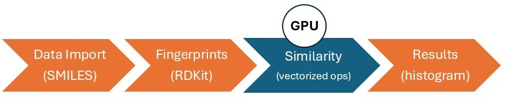

#  Molecular Clustering with GPU Acceleration

Clustering molecules by structural similarity is a core task in cheminformatics and drug discovery. However, pairwise similarity calculations—such as those using the Tanimoto coefficient—become computationally challenging as datasets grow to millions of compounds. By leveraging GPU acceleration in MATLAB, these computations can be performed as loop-free, vectorized operations, enabling efficient analysis of large chemical libraries. This [MATLAB&reg;](https://matlab.mathworks.com/)-[RDKit](https://www.rdkit.org/) example workflow shows how GPU-powered similarity computations makes large-scale clustering practical for big data in drug discovery. For more information, see the [MATLAB GPU Computing](https://www.mathworks.com/help/parallel-computing/gpu-computing.html) documentation.

## Setup 
To Run this example use this MATLAB Live Script: 
> Molecular_Clustering_on_GPU.mlx  

### MathWorks Products (https://www.mathworks.com)

> [MATLAB](https://www.mathworks.com/products/matlab.html)

> [Parallel Computing Toolbox](https://www.mathworks.com/products/parallel-computing.html)

### 3rd Party Products:

> [Python&reg;](https://www.python.org/)

> [RDKit Open-Source Cheminformatics Software](https://www.rdkit.org/)

## Installation
Set up your Python environment by following the instructions provided in the guide found at [Python](https://www.python.org/) webpage. Make sure to give the python address and to check versions of Python compatible with MATLAB products by release. This allows to build proper [MATLAB Interface to Python](https://www.mathworks.com/support/requirements/python-compatibility.html). 

This example uses some of the functions from [RDKit](https://www.rdkit.org/). It can be installed easily by following its installation instructions on Linux, Windows, and macOS. You can install RDKit using _pip install rdkit_.

To run this example, you also need to install the MATLAB Parallel Computing Toolbox, which can be downloaded and installed from the [MathWorks website](https://www.mathworks.com/products/parallel-computing.html) or via the MATLAB Add-On Explorer.

## Getting Started 
Follow the steps provided in this MATLAB Live Script:
> Molecular_Clustering_on_GPU.mlx  

## Exercise
Try the exercise provided at the end of this example:

> **Toxicity Analysis:** Download the “Tox21” dataset from [MoleculeNet](https://moleculenet.org/datasets-1), which contains information about the toxicity of various small molecules. Import this dataset into MATLAB, generate molecular fingerprints, and compute the pairwise similarity matrix using the GPU-enabled workflow from this example.
> **(a)** Examine clusters or bins of molecules with high structural similarity. Do you observe recurring functional groups or substructures (toxicophores) in molecules that are classified as toxic?  
> **(b)** Compare these findings to non-toxic clusters: are there structural motifs that appear to be associated with lower toxicity?

## License
The license is available in the License.txt file in this GitHub repository.

The original dataset is generously provided by Professor Thierry Langer from the University of Vienna. 
The dataset has been made publicly available under CC BY 3.0 AT Attribution 3.0 Austria license in this publication: Molecules 2021, 26, 6185. See the "Dataset_*.rights" for details.

## Community Support
[MATLAB Central](https://www.mathworks.com/matlabcentral)

Copyright 2024 The MathWorks, Inc.

