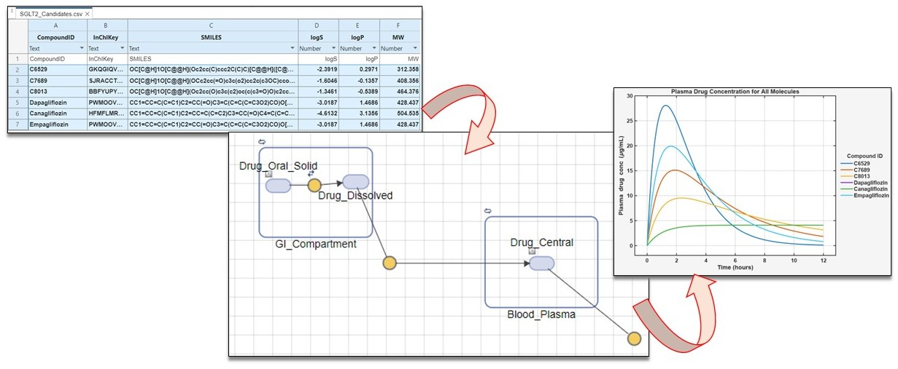

#  Bioavailability Simulation of Drug Like Molecules

This example demonstrates a seamless integration of cheminformatics and pharmacokinetics using [SimBiology&reg;](https://www.mathworks.com/products/simbiology.html) toolbox of [MATLAB&reg;](https://matlab.mathworks.com/) and [RDKit](https://www.rdkit.org/). 

It highlights how molecular descriptors like LogP and LogS can inform early drug development decisions. By combining similarity-based candidate selection with a mechanistic SimBiology model, we simulate the absorption and distribution of potential SGLT2 inhibitors following oral administration. The resulting plasma concentration profiles provide insight into how structural and physicochemical properties influence bioavailability. 

Bioavailability is the fraction of an administered drug (orally) that reaches systemic circulation in an active form. Bioavailability is a critical determinant of a molecule's therapeutic potential and is a key consideration in early drug development. 

This workflow not only bridges chemical structure and biological function but also showcases how MATLAB can accelerate drug discovery by connecting data-driven screening with dynamic system-level simulation.

## Setup 
To Run this example use this MATLAB Live Script: 
> Multiple_Molecules_Bioavailibility.mlx  

### MathWorks Products (https://www.mathworks.com)

> [MATLAB](https://www.mathworks.com/products/matlab.html)

> [SimBiology Toolbox](https://www.mathworks.com/products/simbiology.html)

> [Parallel Computing Toolbox](https://www.mathworks.com/products/parallel-computing.html)

### 3rd Party Products:

> [Python&reg;](https://www.python.org/)

> [RDKit Open-Source Cheminformatics Software](https://www.rdkit.org/)

## Installation
Set up your Python environment by following the instructions provided in the guide found at [Python](https://www.python.org/) webpage. Make sure to give the python address and to check versions of Python compatible with MATLAB products by release. This allows to build proper [MATLAB Interface to Python](https://www.mathworks.com/support/requirements/python-compatibility.html). 

This example uses some of the functions from [RDKit](https://www.rdkit.org/). It can be installed easily by following its installation instructions on Linux, Windows, and macOS. You can install RDKit using _pip install rdkit_.

The SimBiology model requires you to install the MATLAB SimBiology Toolbox, which can be downloaded and installed from the [MathWorks website](https://www.mathworks.com/products/parallel-computing.html) or via the MATLAB Add-On Explorer.

The output dataset from the initial similarity search is provided and ready for use in the SimBiology model. However, if you’d like to run the similarity search yourself (located in the "Similarity_Search" folder), please note that the example leverages GPU acceleration. As such, you'll need to have the MATLAB Parallel Computing Toolbox installed. You can download and install it from the [MathWorks website](https://www.mathworks.com/products/parallel-computing.html) or directly through the MATLAB Add-On Explorer.

## Getting Started 
Follow the steps provided in this MATLAB Live Script:
> Multiple_Molecules_Bioavailibility.mlx    

## Exercise
Try the exercise provided at the end of this example which helps you to explore and learn a more advanced SimBiology model:

>[Incorporate SGLT2 Inhibition into Physiologically Based Glucose-Insulin Model](https://www.mathworks.com/help/simbio/ug/build-sglt2-glucose-insulin-model.html)

## License
The license is available in the License.txt file in this GitHub repository.

The original dataset is generously provided by Professor Thierry Langer from the University of Vienna. 
The dataset has been made publicly available under CC BY 3.0 AT Attribution 3.0 Austria license in this publication: Molecules 2021, 26, 6185. See the "Dataset_*.rights" for details.

## Community Support
[MATLAB Central](https://www.mathworks.com/matlabcentral)

Copyright 2025 The MathWorks, Inc.

