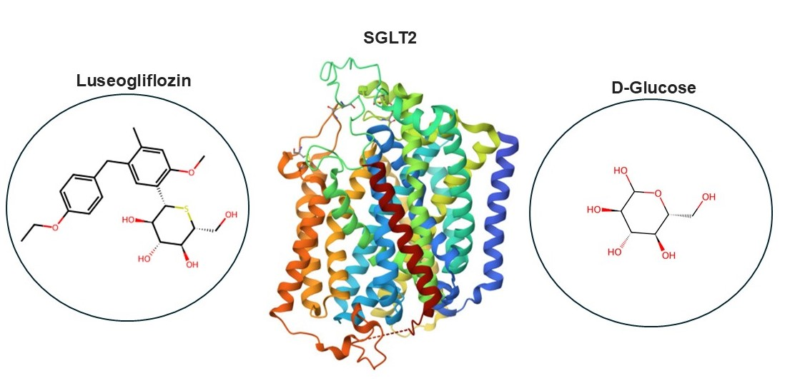
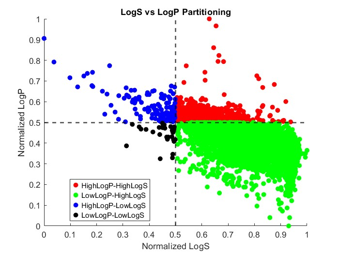
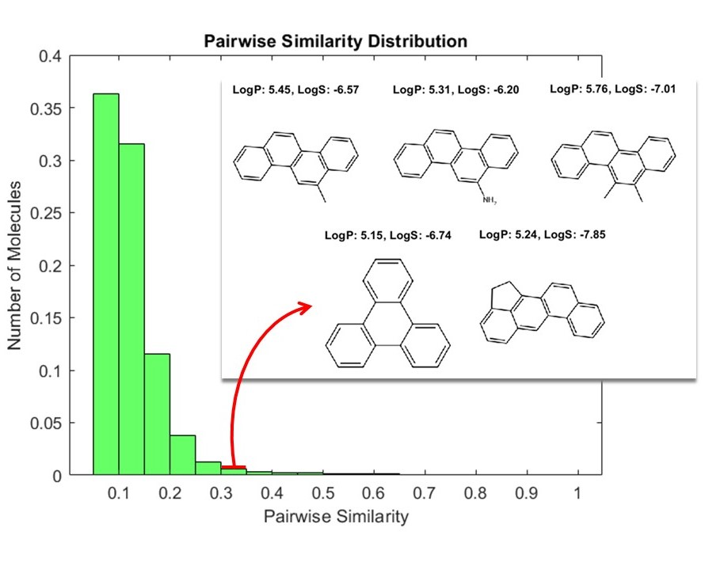
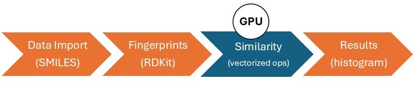
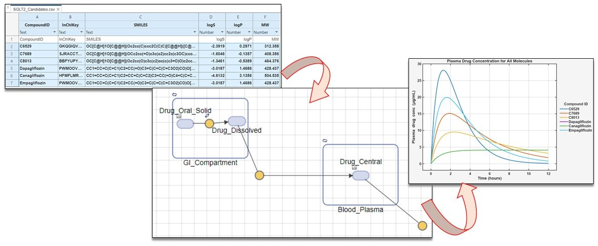

# MATLAB-RDKit: Integrated Cheminformatics and Pharmacokinetics Workflows  

This repository brings together five connected examples showing how [MATLAB®](https://www.mathworks.com/products/matlab.html) and [RDKit](https://www.rdkit.org/) can be combined to accelerate molecular analysis, cheminformatics, and drug discovery.  

Each folder contains a self-contained Live Script and supporting files that illustrate a different step in the workflow, from molecular visualization to similarity analysis, GPU-accelerated clustering, and SimBiology-based bioavailability simulation.  

---

## Repository Contents  

### 1. **Visualize and Analyze Molecular Structures**  
  
Visualize molecular structures from SMILES strings, explore stereochemistry (e.g., D-Glucose, Luseogliflozin), and experiment with 3D protein visualization.  

### 2. **Import, Visualize, and Partition Molecular Datasets**  
  
Import molecular datasets (e.g., LogP and LogS values), visualize molecules, and partition datasets based on normalized physicochemical properties.  

### 3. **Molecular Similarity Analysis**  
  
Compute fingerprints, generate similarity matrices, and analyze the relationship between property-based and structure-based diversity.  

### 4. **Molecular Clustering with GPU Acceleration**  
  
Perform large-scale clustering using GPU-enabled similarity computations (Tanimoto coefficient). Enables practical analysis of millions of molecules.  

### 5. **Bioavailability Simulation of Drug-Like Molecules**  
  
Link cheminformatics with system-level pharmacokinetic modeling in SimBiology. Simulate plasma concentration profiles for potential SGLT2 inhibitors.  

---

## Setup  

Each example is provided as a MATLAB Live Script (`.mlx`) that can be run directly:  

- `Visualize and Analyze Molecular Structures.mlx`  
- `Import_Visualize_and_Partition_Molecular_Datasets.mlx`  
- `Molecular_Similarity_Analysis.mlx`  
- `Molecular_Clustering_on_GPU.mlx`  
- `Multiple_Molecules_Bioavailibility.mlx`  

---

## MathWorks Products  

- [MATLAB](https://www.mathworks.com/products/matlab.html)  
- [Bioinformatics Toolbox™](https://www.mathworks.com/products/bioinfo.html) *(optional for 3D visualization)*  
- [Parallel Computing Toolbox™](https://www.mathworks.com/products/parallel-computing.html) *(required for GPU examples)*  
- [SimBiology Toolbox™](https://www.mathworks.com/products/simbiology.html) *(required for bioavailability simulation)*  

---

## 3rd Party Products  

- [Python®](https://www.python.org/)  
- [RDKit Open-Source Cheminformatics Software](https://www.rdkit.org/)  

---

## Installation  

1. **Python environment**:  
   - Install Python and confirm compatibility with your MATLAB release: [MATLAB–Python interface](https://www.mathworks.com/support/requirements/python-compatibility.html).  
   - Provide the Python executable path in MATLAB.  

2. **RDKit**:  
   - Install with:  
     ```bash
     pip install rdkit
     ```  

3. **MATLAB Add-Ons**:  
   - Install required toolboxes (SimBiology, Bioinformatics, Parallel Computing) via Add-On Explorer or MathWorks website.  

---

## Getting Started  

Run the `.mlx` file inside each folder. Follow the inline documentation to step through the example.  

---

## Exercises  

Each example includes practice exercises to deepen understanding. Highlights include:  

- Visual inspection and similarity quantification.  
- Correlation of structure vs. LogP/LogS.  
- Exploring structural diversity despite property similarity.  
- GPU-accelerated clustering on toxicity datasets.  
- Extending SimBiology workflows with SGLT2 inhibition models.  

---

## References  

- Wieder, O., et al. *Improved Lipophilicity and Aqueous Solubility Prediction with Composite Graph Neural Networks*. Molecules 2021, 26, 6185.  
- Datasets provided by Prof. Thierry Langer, University of Vienna (CC BY 3.0 AT).  

---

## License  

The license is available in the `License.txt` file.  

---

## Community Support  

- [MATLAB Central](https://www.mathworks.com/matlabcentral)  

---

**Copyright 2025 The MathWorks, Inc.**
